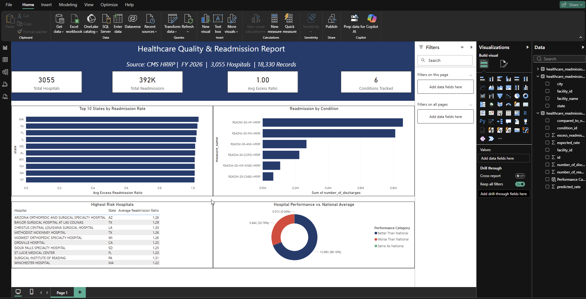

# Healthcare Quality & Readmissions Analytics

**Author:** Ahmed Isse
**Stack:** Python · MySQL · Power BI
**Data Source:** CMS Hospital Readmissions Reduction Program (HRRP) — FY 2026

---

## Dashboard Preview



---

## Project Overview

I wanted to answer a straightforward question: which hospitals, states, and conditions are driving the worst 30-day readmission rates in the U.S.?

I pulled real CMS data, wrote a Python ETL script to clean and load 18,330 records into a normalized MySQL database, ran five analytical queries to find the patterns, and built a Power BI dashboard to present the findings. The whole pipeline — data to dashboard — is in this repo.

---

## Repository Structure

```
healthcare-readmissions-analytics/
├── load_data.py                  # Python ETL — loads CMS data into MySQL
├── schema.sql                    # Database schema and table definitions
├── Q1.sql                        # Top 10 states by avg excess readmission ratio
├── Q2.sql                        # Readmissions by condition nationally
├── Q3.sql                        # Hospital performance vs. national average
├── Q4.sql                        # Top 10 worst performing hospitals
├── Q5.sql                        # State + condition predicted vs. expected rate gap
├── dashboard_preview.png         # Power BI dashboard screenshot
└── README.md
```

---

## Database Schema

The CMS file came as one flat structure. I split it into 3 normalized tables:

```sql
hospitals (
    facility_id     VARCHAR(10)   PRIMARY KEY,
    facility_name   VARCHAR(255),
    state           VARCHAR(5)
)

conditions (
    condition_id    INT           PRIMARY KEY AUTO_INCREMENT,
    measure_name    VARCHAR(255)
)

readmissions (
    id                          INT           PRIMARY KEY AUTO_INCREMENT,
    facility_id                 VARCHAR(10)   FK → hospitals,
    condition_id                INT           FK → conditions,
    excess_readmission_ratio    DECIMAL(6,4),
    predicted_rate              DECIMAL(5,2),
    expected_rate               DECIMAL(5,2),
    number_of_readmissions      INT,
    number_of_discharges        INT
)
```

**3,055 hospitals · 6 conditions · 18,330 readmission records**

---

## ETL Pipeline

The raw file had issues — `N/A`, `Too Few to Report`, and inconsistent numeric types scattered throughout. `load_data.py` handles all of that. It parses the `.numbers` format, coerces the columns, splits everything into the 3 tables, and loads it into MySQL with foreign keys intact.

Not the prettiest data to work with, but that's usually how it goes with real datasets.

```bash
pip install numbers-parser mysql-connector-python pandas
python load_data.py
```

---

## SQL Analysis

### Q1 — Top 10 States by Excess Readmission Ratio
Which states carry the highest readmission burden across their hospital networks?  
**Finding:** Massachusetts, New Jersey, and Florida rank highest. MA was noticeably ahead of the rest.

### Q2 — Readmissions by Condition
How do volumes and excess ratios compare across the 6 tracked conditions?  
**Finding:** Heart Failure runs away with it — 392K+ readmissions, nearly 3x Pneumonia which came in second at 131K. Every other condition wasn't close.

### Q3 — Hospital Performance vs. National Average
How does the overall hospital population split against the national benchmark?  
**Finding:** 69% perform better than average on paper. But nearly half of total readmission volume still comes from underperformers — so the headline number is a bit misleading.

### Q4 — Highest Risk Hospitals
Which facilities have the worst average excess readmission ratios?  
**Finding:** Surgical specialty hospitals show up disproportionately. That's probably worth a deeper look — narrow condition tracking against a broad national benchmark might be skewing the numbers.

### Q5 — Predicted vs. Expected Rate Gap by State & Condition
Where does actual performance diverge most from what the model expects?  
**Finding:** Wyoming CABG and Massachusetts AMI have the largest gaps nationally. Honestly not sure what's driving Wyoming specifically — it stood out enough to flag.

---

## Power BI Dashboard

Connects directly to MySQL via MySQL Connector/NET. Built for a strategy audience — the goal was clarity over complexity.

| Visual | Description |
|---|---|
| KPI Cards | Total hospitals, total readmissions, avg excess ratio, conditions tracked |
| Bar Chart | Top 10 states by average excess readmission ratio |
| Bar Chart | Total discharges by clinical condition |
| Donut Chart | Hospital performance vs. national average |
| Table | Top 10 highest risk hospitals |

**DAX Calculated Column:**
```dax
Performance Category = 
IF(readmissions[excess_readmission_ratio] < 1, "Better Than National",
IF(readmissions[excess_readmission_ratio] > 1, "Worse Than National",
"Same As National"))
```

---

## Key Findings

- **MA, NJ, and FL** have the highest average excess readmission ratios in the country
- **Heart Failure** is the dominant condition — 392K+ readmissions and it's not close
- **Nearly half of all hospitals** perform worse than the national benchmark despite the overall rate looking favorable
- **Surgical specialty hospitals** keep showing up at the top of the risk list — the benchmark comparison may need more nuance here
- **Wyoming CABG** has the largest predicted vs. expected rate gap nationally — flagged but needs more investigation

---

## Skills Demonstrated

`Python` · `ETL Pipeline` · `MySQL` · `Relational Schema Design` · `Multi-table JOINs` · `CASE WHEN` · `Aggregations` · `Power BI` · `DAX` · `Healthcare Analytics` · `CMS Data`
